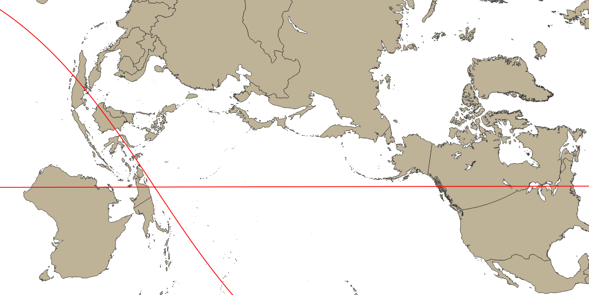

# Map projections optimized for Canada + the Asia Pacific region

## Oblique Mercator
The Oblique Mercator is a mercator projection defined by a great circle other than the Equator. Distortion is minimized along that arc and gets exponentially worse the further you get from it. Ideal for visualizing long strips such as flight plans.
In this context it can be defined by two points such as major cities.

In a Proj4 string, e.g. for Toronto <-> Perth:
`+proj=omerc +lon_1=-79 +lat_1=43 +lon_2=116 +lat_2=-31 +ellps=GRS80`

### Canada
* **Vancouver**: 49,-123
* **Calgary**: 51,-114
* **Toronto**: 44,-79
* **Ottawa**: 45.5,-75.7
* **Montreal**: 45.5, -73.5

### Asia Pacific
* **Tokyo**: 35.7, 139.7
* **Hong Kong**: 22, 114
* **Singapore**: 1.3, 103.8

